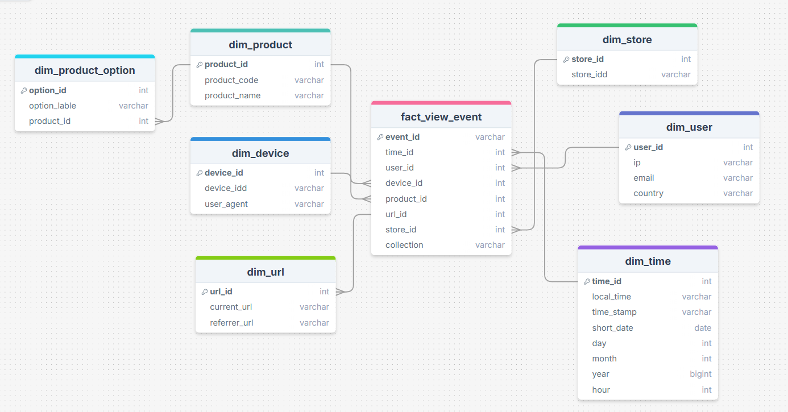

# prj_spark
Tạo project sử dụng kafka để streaming dữ liệu từ server , dùng spark để xử lý và lưu vào postgres. Dùng superset để tạo dashboard
## 1/Start hadoop:

-Vào thư mục hadoop chạy lệnh: docker compose up -d

-Kiểm tra :The Namenode UI can be accessed at http://localhost:9870/ and the ResourceManager UI can be accessed at http://localhost:8088/

## 2/Start postgres:

-Vào thư mục postgres chạy lệnh: docker compose up -d
-Kiểm tra: http://localhost:8380

-Tạo DB postgres:

-Clear data:

delete from dim_device;

delete from dim_product;

delete from dim_product_option;

delete from dim_store;

delete from dim_time;

delete from dim_url;

delete from dim_user;

delete from fact_view;

## 3/Vào thư muc spark chạy lệnh sau:

docker container stop kafka-streaming || true &&
docker container rm kafka-streaming || true &&
docker run --rm -ti --name kafka-streaming \
--network=streaming-network \
-v ./:/spark \
-v spark_lib:/home/spark/.ivy2 \
-v spark_data:/data \
-e HADOOP_CONF_DIR=/spark/hadoop-conf/ \
-e PYSPARK_DRIVER_PYTHON='python' \
-e PYSPARK_PYTHON='./environment/bin/python' \
-e KAFKA_BOOTSTRAP_SERVERS='46.202.167.130:9094,46.202.167.130:9194,46.202.167.130:9294' \
-e KAFKA_SASL_JAAS_CONFIG='org.apache.kafka.common.security.plain.PlainLoginModule required username="kafka" password="UnigapKafka@2024";' \
unigap/spark:3.5 bash -c "(cd /spark/11-kafka-streaming && zip -r /tmp/util.zip util/*) &&
conda env create --file /spark/environment.yml &&
source ~/miniconda3/bin/activate &&
conda activate pyspark_conda_env &&
conda pack -f -o pyspark_conda_env.tar.gz &&
spark-submit  --packages org.apache.spark:spark-sql-kafka-0-10_2.12:3.5.1,org.postgresql:postgresql:42.7.3 \
--conf spark.yarn.dist.archives=pyspark_conda_env.tar.gz#environment \
--py-files /tmp/util.zip,/spark/11-kafka-streaming/spark.conf \
--deploy-mode client \
--master yarn \
/spark/11-kafka-streaming/kafka_streaming.py"

## 4/Kết nối Superset: 

Vảo thư mục superset:

B1: Cài python: sudo apt install python3-pip python3-venv

B2: Tạo môi trường: 

python3 -m venv superset-env
source superset-env/bin/activate

B3: Chạy superset: 

 superset run -h 0.0.0.0 -p 8089 --with-threads --reload --debugger

B4: Vào web:  http://localhost:8089/

